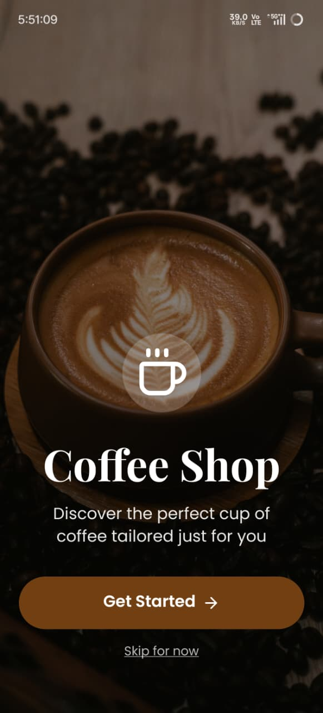
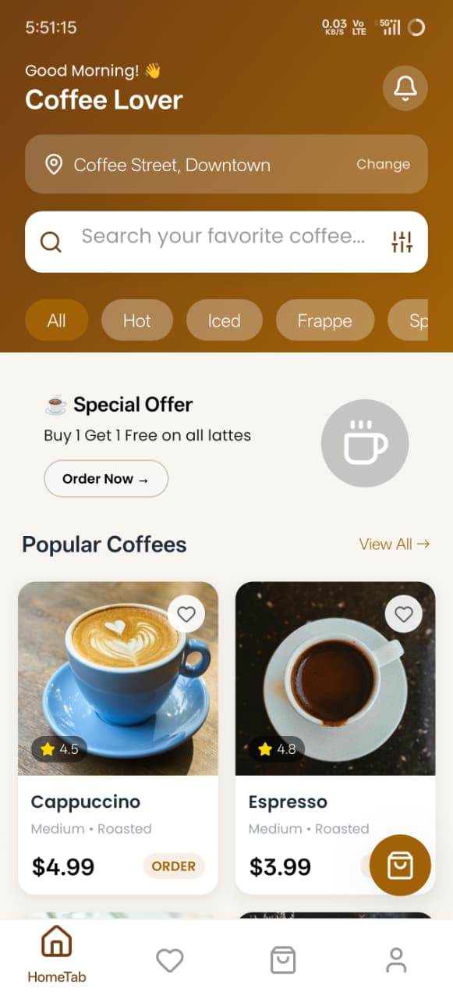
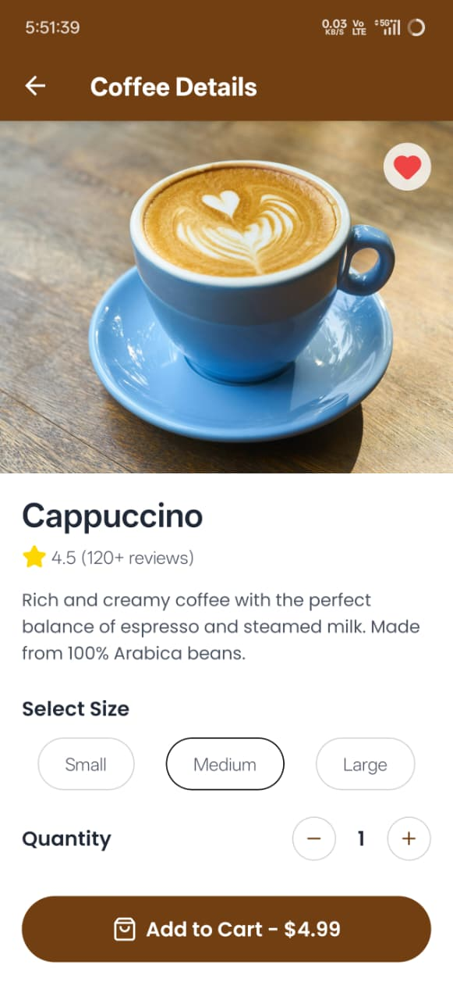
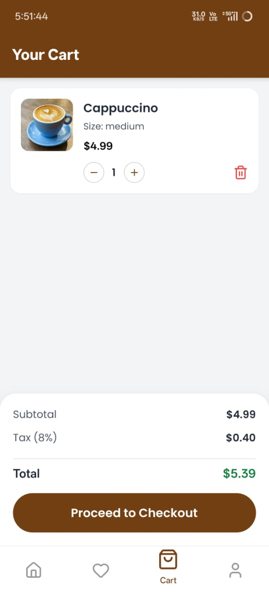

# ☕ Coffee Shop App

A beautiful and modern coffee shop mobile application built with **React Native CLI**. This app provides a seamless coffee ordering experience with a stunning UI, smooth animations, and complete e-commerce functionality.

## 📱 Screenshots

  <table>
    <tr>
      <td align="center"><strong>Get Started</strong></td>
      <td align="center"><strong>Home Screen</strong></td>
      <td align="center"><strong>Details Screen</strong></td>
      <td align="center"><strong>Cart Screen</strong></td>
    </tr>
    <tr>
      <td></td>
      <td></td>
      <td></td>
      <td></td>
    </tr>
  </table>

## ✨ Features

### 🏠 Core Features
- **Beautiful Onboarding** - Animated get started screen with background image
- **Coffee Grid Display** - Browse coffee collection with search functionality
- **Pull to Refresh** - Refresh the coffee list with smooth animation
- **Search & Filter** - Search coffees by name and filter by categories
- **Categories** - Filter coffees by Hot, Iced, Frappe, and Special

### 📱 Coffee Details
- **Size Selection** - Choose from Small, Medium, Large sizes
- **Quantity Selector** - Adjust quantity with +/- buttons
- **Dynamic Pricing** - Price updates based on size and quantity
- **Favorite Button** - Save favorite coffees with heart icon
- **Add to Cart** - Add items to cart with success modal animation

### 🛒 Cart Management
- **View Cart Items** - List all added items with images
- **Update Quantity** - Increase/decrease item quantity
- **Remove Items** - Delete items with confirmation alert
- **Price Calculation** - Subtotal, tax (8%), and total calculation
- **Empty Cart State** - Beautiful empty cart screen with CTA

### 📦 Order System
- **Checkout Form** - Complete order form with validation
- **Payment Methods** - Card and PayPal payment options
- **Order Confirmation** - Success modal with order details
- **Order Tracking** - Real-time order status tracking
- **Order History** - View all past orders with details

### ❤️ Favorites System
- **Save Favorites** - Heart icon to save favorite coffees
- **Persistent Storage** - Favorites saved locally with AsyncStorage
- **Clear All** - Remove all favorites at once
- **Empty State** - Friendly message when no favorites

### 👤 Profile Management
- **User Profile** - View and edit profile information
- **Statistics** - Orders count, favorites count, loyalty points
- **Settings** - Account settings, addresses, payment methods
- **Edit Profile Modal** - Edit name, email, phone, address

### 🎨 UI/UX Features
- **Smooth Animations** - FadeIn, SlideIn, Layout animations with Reanimated
- **Parallax Header** - Animated header with parallax scrolling effect
- **Gradient Backgrounds** - Beautiful gradient colors throughout
- **Glassmorphism** - Blur effects on cards and elements
- **Custom Fonts** - Poppins and Playfair Display fonts
- **Responsive Design** - Works on all screen sizes
- **Dark Mode Ready** - Color scheme supports dark mode

## 🛠️ Tech Stack

### Frontend
- **React Native CLI** - Core framework
- **React Navigation** - Navigation (Stack & Bottom Tabs)
- **NativeWind** - Tailwind CSS for styling
- **React Native Reanimated** - Smooth animations
- **Lucide React Native** - Modern icon set
- **React Native Modal** - Custom modal components

### State Management
- **React Context API** - Cart and Favorites state management
- **AsyncStorage** - Persistent storage for favorites

### Development Tools
- **React Native CLI** - Development environment
- **Metro** - JavaScript bundler
- **Gradle** - Android build system
